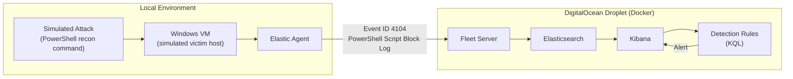

# Architecture

## Overview

The lab is a **hybrid cloud/local architecture**: the SIEM backend runs in the cloud (for always-on access to Kibana without managing on-prem hardware), while the only thing running locally is a single Windows VM acting as the telemetry-generating "victim" host.

## Design Decisions

| Decision | Rationale |
|---|---|
| Cloud-hosted SIEM (DigitalOcean) | Ease of access to Kibana anytime, no on-prem server management |
| Docker for the Elastic Stack | Reproducible, portable deployment; hands-on containerization experience |
| Local Windows VM for telemetry | Keeps local resource requirements minimal — only one VM needs to run locally |
| Elastic Agent + Fleet | Centralized, scalable agent management instead of manually configuring Beats |
| PowerShell Script Block Logging (Event ID 4104) as first log source | High-value, attacker-relevant telemetry that captures full executed code, not just process metadata |

## Data Flow

## Component Breakdown

### 1. DigitalOcean Droplet
Hosts the entire Elastic Stack via Docker Compose. Chosen for low cost and simplicity over managing bare-metal or on-prem infrastructure.

### 2. Docker / Docker Compose
Runs Elasticsearch, Kibana, and Fleet Server as containers. Provides a consistent, teardown-and-rebuild-friendly environment — useful for re-provisioning the lab from scratch at any time.

### 3. Elasticsearch
Stores and indexes all ingested log data. Backend for search, dashboards, and detection rule execution.

### 4. Kibana
Web UI for querying data, building dashboards, and authoring/managing detection rules.

### 5. Fleet Server + Elastic Agent
Fleet Server (cloud-side) centrally manages Elastic Agent policies. The Elastic Agent (installed on the Windows VM) ships host telemetry back to the stack — in this case, a custom integration targeting the `Microsoft-Windows-PowerShell/Operational` event log channel.

### 6. Windows VM (local)
The only component that runs on local hardware. Acts as the "host" being monitored — this is where simulated attacker activity is generated (e.g., a PowerShell reconnaissance one-liner) to produce realistic Event ID 4104 log entries.

### 7. Detection Rules
Built in Kibana using KQL against the ingested PowerShell telemetry. The first rule in this lab is scoped to a technique referenced in a real CISA advisory, mirroring how detection assignments arrive in production ("does our environment detect this advisory's TTP?").

## Threat Model / Scope Notes

- This lab is intentionally single-host for simplicity. It is not meant to simulate a full enterprise network, domain, or multi-host lateral movement.
- The Windows VM should be isolated (host-only or NAT network) — it is running attacker-emulation commands and should not have unrestricted access to production networks or the internet where avoidable.
- Credentials and any droplet IP addresses used in the real build should never be committed to this repository. Use environment variables / a `.env` file (excluded via `.gitignore`) for anything sensitive.
